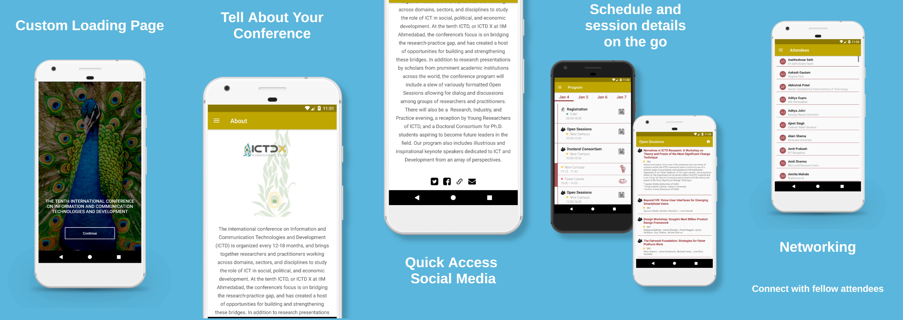
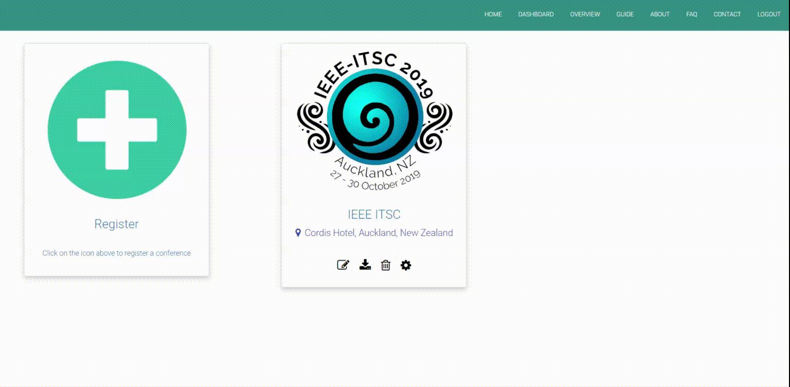

# Conference Portal

Conference Portal is a web-based service to generate a customized android application for your conference. It consists of two components - **django-based web application** and a **generic android application**. The organizers register their conference, along with the required details on the web service, which then generates a specific APK file for that particular conference. The final application will support two modes - offline and online. 

 

 

This project was done as an Independent Project by [Saatvik Jain](https://www.github.com/saatvikj) & [Meghna Gupta](https://www.github.com/gupta-meghna64) under the guidance of [Dr. Pushpendra Singh](https://www.pushpendrasingh.org/) at [IIIT Delhi](https://www.iiitd.ac.in).

# Features

The application downloaded from this web service is divided into two sections: **Online** and **Offline**. Common features in both online and offline are:
- [Day wise event schedule](#day-wise-event-schedule)
- [Event information and socials](#event-information-and-socials)
- [Food breaks during the event](#food-breaks)
- [Event location details](#location-details)
- [Event attendees](#attendee-details)

These features do not require an internet connection. The online mode takes advantage of internet connection to add several more features. These features are:
- [Attendee profiles](#attendee-profiles)
- [Social media feed](#social-media-feed)
- [Networking opportunities](#networking-opportunities)

#### Day wise event schedule
This features lets you view the entire schedule along with breaks. Need to know about what is being presented where? Its on the schedule page. Want to know more about a particular event? Click on it in the schedule page and see all details like abstracts, speakers and more. Create your own agenda by simple click of a button and view it separately for segregration. All events in personal agenda get their own reminder system linked to your Google Calendar.
The event schedule can be edited by the organizers through the webapp and users recieve push notifications to notify them accordingly.

#### Event information and socials
This feature provides detailed information about the conference and its edition. It also provides one touch access to the website and various social media handles of the conference like Facebook, twitter, etc. which can be used by the users to know more.

#### Food breaks
No conference is complete without snack and lunch break. This features lets the attendees know information like time, venue, description, etc. regarding the food breaks that are scheduled to happen throughout the conference.

#### Location details
Through this feature, attendees can get to know the exact venue and dates of the conference and also navigate their journey to the location with the help of Google Maps.

#### Attendee details
To connect with the fellow attendees, this features provides a comprehensive list of all the attendees to the users. It displays the name, and affiliation of the attendee. The participants can connect with another by sending an email through just a click.

#### Social media feed
Once a user is logged in, they can post content in an in-app social media feed. Content supports clickable links and hashtags and tapping on a particular hashtag brings up all posts with that hashtag. Hashtags help with better specific outreach and posts facilitate attendee interaction.

#### Attendee profiles
Each attendee recieves a mail on their email ID with a one-time joining code that lets them create a profile on the application. Profile includes information like interests, contact details and images. These profiles help identify attendees better.

#### Networking opportunites
With user profiles, you can view extra information about all users once you are registered. Social media handles, email, collaboration opportunities, all within one place. It helps in hassle-free networking.

# Demo of Webapp
 

 

# Generated Application

# Development
The portal service contains of a web application and produces an android apk specific to the requirements of the conference. Necessary libraries for recreating the web and android application are listed below. 

### Web Application

#### Libraries Used
- django [Docs](https://docs.djangoproject.com/en/2.2/)
- pyrebase [Docs](https://github.com/thisbejim/Pyrebase)
- pycountry [Docs](https://pypi.org/project/pycountry/)

### Android Application

#### Libraries Used
- recycler-fast-scroll [Docs](https://github.com/FutureMind/recycler-fast-scroll)
- android-about-page [Docs](https://github.com/medyo/android-about-page)
- FastCSV [Docs](https://github.com/osiegmar/FastCSV)
- glide [Docs](https://github.com/bumptech/glide)
- SmartTabLayout [Docs](https://github.com/ogaclejapan/SmartTabLayout)

